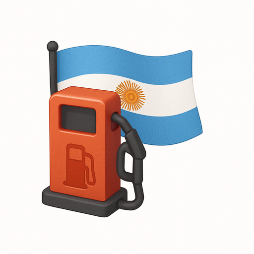

<div align="center">

# Petrohaus



**Encuentra los mejores precios de combustibles en tu zona**

<p>

</p>

</div>

---

## Prerrequisitos

-   **Nix** (con Flakes habilitado): [Instalar Nix](https://nixos.org/download.html)
    -   Habilitar Flakes: `mkdir -p ~/.config/nix && echo 'experimental-features = nix-command flakes' >> ~/.config/nix/nix.conf`
-   **Docker** y **Docker Compose**: [Instalar Docker](https://docs.docker.com/get-docker/)
-   (Opcional) **direnv**: Para cargar el entorno automáticamente con `.envrc`

---

## Build

### Con Nix

1. Entra al entorno de desarrollo:
    ```sh
    nix develop
    ```
    O, si usas direnv, solo entra a la carpeta del proyecto y ejecuta `direnv allow`.
1. Copia el archivo `.env.example` a `.env` y configura las variables de entorno.
    ```sh
    cp .env.example .env
    ```
1. Instala las dependencias de PHP y Node:
    ```sh
    composer install
    npm install
    ```
1. Compila los assets del frontend:
    ```sh
    npm run build
    ```

### Con Docker

1. Construye e inicia los contenedores:
    ```sh
    docker compose up --build
    ```
    Esto iniciará la app y una base de datos Postgres.

---

## Uso

### Desarrollo local (Nix)

-   Inicia el servidor de Laravel y el servidor de desarrollo de Vite:
    ```sh
    composer run dev
    ```
    Esto ejecuta PHP, la cola, logs y Vite de forma concurrente.
-   Accede a la app en [http://localhost:8080](http://localhost:8080)

### Desarrollo local (Docker)

-   La app estará disponible en [http://localhost:8080](http://localhost:8080)
-   La base de datos corre en `localhost:5432` (ver `docker-compose.yml` para credenciales)

### Git Hooks

-   Al iniciar por primera vez, el entorno Nix ejecuta `bin/setup-hooks.sh` para instalar un pre-commit hook que corre Pint y PHPStan. Esto no es necesario si se usa direnv.

---

## Proceso CI/CD

-   El workflow de GitHub Actions corre en pushes y PRs a las ramas `main` y `feature/*`.
-   Los pasos incluyen:
    -   Instalar Nix
    -   Instalar dependencias (`composer install`, `npm install`)
    -   Ejecutar Pint (estilo de código PHP)
    -   Ejecutar PHPStan (análisis estático)
-   Ver [`.github/workflows/lint.yml`](../.github/workflows/lint.yml) para más detalles.

---
